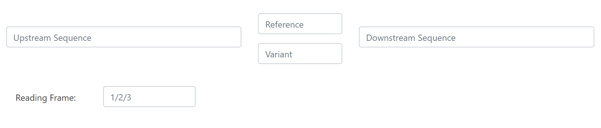

<!-- PROJECT LOGO -->
<br />
<p align="center">

  <h1 align="center">BE-FF</h1>

  <p align="center">
    Web-based tool which identifies suitable base editors to correct single nucleotide variations.
    <br />
    <a href="http://danioffenlab.pythonanywhere.com/"><strong>Go to website >> </strong></a>
   
  </p>


<!-- TABLE OF CONTENTS -->
## Table of Contents

* [About](#ABOUT)
* [BEsingle.py](#built-with)
  * [Methods to Enter Data](#methods)
* [BEMain.py](#BEMain.py)
* [Contact](#contact)

<!-- ABOUT  -->
## ABOUT

BE-FF is a web-based tool that receives SNV data and matches suitable BEs to correct the
variation. The code for the online tool is available here, as well as batch-mode code that may be used
to generate results for a large number of SNV's.
The 2 main scripts are:


## 1. BEsingle.py: 
This is the main script of the website. It receives a single SNV, via 3 possible methods: <br> 

* <i> Manually entered by user:</i> <br> Here you must enter a 51-nt long DNA sequence, 25 nt upstream to the mutation and 25 nt downstream, as well as the variation and the reading frame. 

 
* <i> Fetched by given rsID: </i> Enters a known rsID. You will then be presented with a table containing all the possible variations. Once you selects one of the options, it will automatically be inserted into the format in (a). 


* <i> Fetche by genomic coordinates: </i> You may select a genome, chromosome number, mutation position, variation, and reading frame, which will be inserted into the format in (a).
 

**Note: Only one of these methods is required each time. **
 
You may also use the **'Advanced Options'** button and create you own BE. This base editor will appear as
'User customized BE' in the final results

Press the <u> submit </u> button to show the results. You will be presented with two tables:
1. Table of  base editors that will correct this variance and no other bases around it.
2. Table of base editors that will correctly edit the SNP. However it may also edit other flanking nucleotides.
Such changes are synonymous substitutions and the resulted amino acid sequence will probably be as good as the reference sequence.

## 2. BEMain.py
In the main function of this script, enter a csv table of the following format:
[Template](sample3.csv)

The result will be a new CSV file containing all the SNV's and the possible BE that can corect the variation. 


<!-- GETTING STARTED -->
## Getting Started

To get a local copy up and running follow these simple steps.


### Installation
 
1. Clone the repo
```sh
git clone https://github.com/RoyRabinowitz/BE-FF
```
2. Install biopython packages
```sh
pip install biopython 
```

<!-- CONTACT -->
## Contact

[Roy Rabinowitz](rabinowitz.roy@gmail.com) - email

[Shiri Almog](shirialmog1@gmail.com)  -email

Website: [http://danioffenlab.pythonanywhere.com](http://danioffenlab.pythonanywhere.com)

Project Link: [https://github.com/RoyRabinowitz/BE-FF](https://github.com/RoyRabinowitz/BE-FF)


<!-- ACKNOWLEDGEMENTS -->
## Acknowledgements

* []()
* []()
* []()

